# Áreas

## Interiores

As áreas interiores da casa são dispostas da seguinte forma:

| Andar | Divisão               | Área (m2)  | Altura Paredes | Volume (m3) | Perímetro Paredes (ml) | Área paredes (sqm) |
| ----- | --------------------- | ---------- | -------------- | ----------- | ---------------------- | ------------------ |
| RC    | Hall                  | 10,29      | 2,5            | 25,725      | 12,62                  | 31,55              |
| RC    | WC                    | 7,39       | 2,5            | 18,475      | 10,45                  | 26,125             |
| RC    | Cozinha               | 19,15      | 2,5            | 47,875      | 13,88                  | 34,7               |
| RC    | Sala                  | 60,94      | 2,7            | 164,538     | 28,29                  | 76,383             |
| RC    | S. Máquinas           | 11,14      | 2,5            | 27,85       | 17,59                  | 43,975             |
| RC    | Hall traseiro         | 1,34       | 2,7            | 3,618       | 1,7                    | 45,9               |
| 1/2   | Patamar Churrasqueira | 2,59       | 4              | 10,36       | 5,33                   | 21,32              |
| 1º    | Hall                  | 6,05       | 2,7            | 16,335      | 8,95                   | 24,165             |
| 1º    | Lavandaria            | 8,06       | 2,7            | 21,762      | 13,36                  | 36,072             |
| 1º    | Dispensa              | 3,44       | 2,7            | 9,288       | 7,6                    | 20,52              |
| 1º    | Corredor              | 7,43       | 2,7            | 20,061      | 15,52                  | 41,904             |
| 1º    | WC Pequeno            | 5,44       | 2,7            | 14,688      | 9,52                   | 25,704             |
| 1º    | Q. Visitas            | 12,61      | 2,7            | 34,047      | 14,38                  | 38,826             |
| 1º    | Q. RT                 | 19,53      | 2,7            | 52,731      | 18,82                  | 50,814             |
| 1º    | Q. G                  | 12,99      | 2,7            | 35,073      | 15,22                  | 41,094             |
| 1º    | WC Grande             | 9,25       | 2,7            | 24,975      | 14,2                   | 38,34              |
| 1º    | Q. L                  | 14,6       | 2,7            | 39,42       | 15,74                  | 42,498             |
| 1 1/2 | Patamar               | 1          | 2,5            | 2,5         |                        | 75                 |
| 2º    | Sotão                 | 38,95      | 2,5            | 97,375      | 22,24                  | 55,6               |
| 2º    | Varanda               | 10,27      |                | 0           |                        | 0                  |
|       | **TOTAL**             | **262,46** |                | **666,696** | **261**                | **770,49**         |

## Exteriores

As áreas exteriores da casa são dispostas da seguinte forma:

| Exteriores       |      | Área Plana | Janelas (aprox) | Área a pintar |
| ---------------- | ---- | ---------- | --------------- | ------------- |
| Fachada Nascente |      | 104,72     | 20              | 84,72         |
| Fachada Sul      |      | 60         | 7               | 53            |
| Fachada Poente   |      | 75         | 11              | 64            |
| Fachada norte    |      | 55         | 2               | 53            |
| Extensão Sul     |      | 34         | 4               | 30            |
| Extensão Poente  |      | 17         | 2               | 15            |
| Entensão Norte   |      | 20         |                 | 20            |
| TOTAL            |      | 365,72     | 46              | 319,72        |

## Aberturas

### Portas

| ID   | Zona | Descrição              | Modelo                          | Largura (cm) | Abertura | Espessura da parede (cm) | Comentários |
| ---- | ---- | ---------------------- | ------------------------------- | ------------ | -------- | ------------------------ | ----------- |
| 1    | R/C  | Porta Sala (Dupla)     | Pantografado AP1                | 160          | Direita  | 13                       | Com chave   |
| 2    | R/C  | Porta WC               | Pantografado DP                 | 80           | Esquerda | 23                       | On/Off WC   |
| 3    | R/C  | Sala das Máquinas      | Correr por fora Pantografado DP | 80           | Direita  | 13                       | Com chave   |
| 4    | 1º   | Lavandaria             | Pantografado DP                 | 70           | Esquerda | 13                       | Com chave   |
| 5    | 1º   | WC L                   | Pantografado DP                 | 80           | Direita  | 13                       | On/Off WC   |
| 6    | 1º   | Closet                 | Pantografado DP                 | 80           | Direita  | 13                       | Com chave   |
| 7    | 1º   | Quarto RT              | Pantografado DP                 | 80           | Direita  | 13                       | Com chave   |
| 8    | 1º   | Quarto G               | Pantografado DP                 | 80           | Esquerda | 13                       | Com chave   |
| 9    | 1º   | WC Grande              | Pantografado DP                 | 80           | Esquerda | 13                       | On/Off WC   |
| 10   | 1º   | Quarto L               | Pantografado DP                 | 80           | Direita  | 13                       | Com chave   |
| 11   | 1º   | Escadas Sotão          | Pantografado DP                 | 80           | Esquerda | 13                       | Com Chave   |
| 12   | 1º   | Despensa               | Pantografado DP                 | 80           | Direita  | 13                       | Com chave   |
| 13   | 1º   | Debaixo das escadas 2o | Pantografado DP                 | 70           | Direita  | 13                       | Com chave   |

Todas as portas tem puxadores **Tupai 4007 5S** na cor 158 (**purist brass**).

Todas as portas tem **fechadura magnética**.

As portas localizadas no **rés-de-chão** têm **dobradiças ocultas**, enquanto as do 1º andar têm dobradiças convencionais.

As portas dos **WCs** não têm chave, mas sim sistema de "**Ocupado/Desocupado**".

### Janelas

| ID   | Descrição            | Largura | Altura | Material | Vidro Laminado | Acústico | Fosco |
| ---- | -------------------- | ------- | ------ | -------- | -------------- | -------- | ----- |
| 1    | Cozinha              | 1380    | 1200   | PVC      | Sim            |          |       |
| 2    | Janela Sacada Sala 1 | 2050    | 2000   | Alumínio | Sim            |          |       |
| 3    | Janela Sacada Sala 2 | 2050    | 2000   | Alumínio | Sim            |          |       |
| 4    | Janela Sala 1        | 1200    | 1280   | PVC      | Sim            | Sim      |       |
| 5    | Janela Sala 2        | 1200    | 1280   | PVC      | Sim            | Sim      |       |
| 6    | Janela Sala 3        | 1200    | 1280   | PVC      | Sim            | Sim      |       |
| 7    | Janela WC R/C        | 1200    | 1280   | PVC      | Sim            | Sim      | Sim   |
| 8    | Quarto RT Sul        | 1300    | 1200   | PVC      |                | Sim      |       |
| 9    | Quarto RT Oeste      | 1300    | 1200   | PVC      |                | Sim      |       |
| 10   | Closet               | 1300    | 1200   | PVC      |                | Sim      |       |
| 11   | Janela WC L          | 760     | 1200   | PVC      |                |          | Sim   |
| 12   | Quarto G             | 1300    | 1200   | PVC      |                | Sim      |       |
| 13   | Quarto G Sacada      | 1600    | 2000   | PVC      |                | Sim      |       |
| 14   | WC Grande 1          | 1220    | 1390   | PVC      |                |          | Sim   |
| 15   | WC Grande 2          | 1220    | 1390   | PVC      |                |          | Sim   |
| 16   | Quarto L Sacada      | 1600    | 2000   | PVC      |                | Sim      |       |
| 17   | Sotão Sacada         | 2000    | 2000   | PVC      |                |          |       |
| 18   | Vidro Fixo 1º andar  | 1000    | 2260   | PVC      |                |          |       |
| 19   | Saída Churrasqueira  | 1000    | 2300   | PVC      | Sim            |          |       |
| 20   | Saída R/C            | 1000    | 2260   | PVC      | Sim            |          |       |
| 21   | Vidro Vitral         | 830     | 2480   | PVC      |                |          |       |
| 22   | Janela Sacada RT     |         | 2000   | PVC      | Sim            | Sim      |       |

# Placas e pisos

## Placa do Rés-de-Chão

A placa do rés-de-chão tem a seguinte composição:

- **15 cm** de **betão armado** C25 com **malha sol**, em cima de brita 2.
- **4 cm** de placas de isolamento **XPS** (poliestireno extrudido, tipo IFOAM)
- **10 cm** de **camada de cimento** misturado com Leca (argila expandida), embutindo tubagens de electricidade, canalização e ventilação
- **6 cm** de **piso radiante** hidráulico
- **4 cm** de **cimento fino** de acabamento de contrapiso
- **2 mm** de **microcimento** Espada F da Microcrete no global e Armadura Excelência Hidrofogo no WC

A altura final da **placa** ficou acima dos **35 cm**.

Em todo o perimetro do sub-piso foi ainda criada uma rede de drenos que permite a escoação de águas pluviais para o exterior

## Placa do 1º andar

A placa existente do 1º andar foi mantida, no entanto esta apresentava desnivelamentos. Os mesmos foram corrigidos com camadas de cimento de 1 a 5 cm de altura ao longo do piso. Nos WCs foi instalada o aquecimento radiante hidráulico antes da correção do piso, enquanto nas restantes divisões foi dado o desconto da mesma para posterior aplicação enquanto sub-piso antes do acabamento final (flutuante hidrofugo da FINSA - Herringbone Dijon).

#### Microcimento WCs

Para o WC pequeno usou-se 3L de base com 1,5L de resina hidrofuga para cada uma das demãos.

## Piso do 2º andar

O 2º andar era composto por chão de madeira de pinho. Todo o piso da parte habitável foi afagado e envernizado. O mesmo foi mantido, afim de manter a traça da casa. Por baixo deste existia um tecto falso para o primeiro andar. O mesmo foi também mantido, mesmo com a construção de um 2º tecto falso por baixo do mesmo.

# Pladur

## Placagens

No sotão foi instalado pladur hidrofugo em todo o perímetro, com lã de rocha de 128mm com revestimento de alumínio na face que confronta com o telhado. Nas zonas rebaixadas, foi instalado XPS em vez de lã de rocha, para melhor isolamento.

No 1º andar, as paredes são de tijolo, aparte da parede que separa o WC grande com o quarto sul. Esta foi construida do lado do WC com pladur hidrofogo, e do lado do quarto com pladur acústico. Também foram construídas 2 paredes de pladur junto às de tijolo já existentes para reforço acústico. Uma delas foi construida no quarto sul poente, na fronteira o quarto sul nascente. A outra foi construida no quarto poente, para o lado do quarto sul poente.

Os tectos do primeiro andar são de pladur standard, com lã de rocha de 160mm.

No rés de chão, foi instalado pladur hidrofogo em todo o perimetro da sala/cozinha, tendo por trás Boltherm termo-acústico. A parede norte tem Aquapanel, que em vez de ser de pladur é feita de fibras e cimento. Essa parede foi ainda toda revestida a XPS e feita uma parede de frente, para deixar caixa de ar. O WC foi construido no interior com pladur hidrofugo, e no exterior com pladur acústico, assim como o hall de entrada que também tem pladur acústico.

Os tectos foram feitos com pladur standard, reforçados com lã de rocha de 200mm.

## Reforços

A parede norte da sala ficou reforçada com madeira de confragem por dentro, afim de poder acolher um suporte para televisão.

As devidas medidas do suporte são identificadas na imagem abaixo.

A parede da cozinha que faz confrontação com o Hall de entrada também ficou reforçada com madeira de confrangem, para poder suster os móveis de cozinha.

As medidas são detalhadas abaixo.

# Aquecimento

## Radiante Hidráulico

O piso radiante hidráulico encontra-se instalado somente no Rés-de-Chão. Este está dividido por secções para garantir a uniformidade do aquecimento nas diversas áreas, prevenindo problemas tais como áreas com maior exposição solar, ou áreas mais distantes da bomba de calor sejam afectadas.

## Termoconvectores

Adicionalmente à rede de aquecimento radiante, foi instalada uma rede de aquecimento por via de termoconvectores, utilizando a rede hidráulica com base na bomba de calor.

Essa rede funciona no 1º andar, e ainda existe uma pré-instalação no 2º andar.

O mapa de instalação da rede no 1º andar, é composta por 7 elementos, dispostos da seguinte forma:

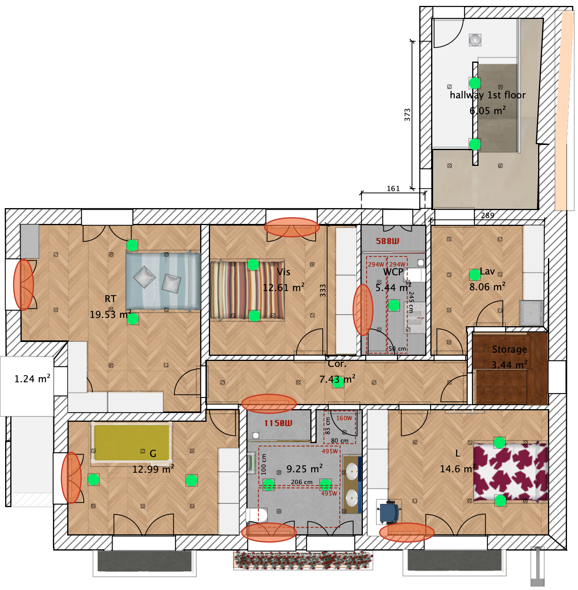

## Radiante Eléctrico

O piso radiante eléctrico foi instalado somente no primeiro andar. Nos WCs foi instalado por baixo do piso de cimento pois o acabamento é em microcimento. Nas restantes divisões a instalação é feita directamente debaixo do piso flutuante. O piso radiante eléctrico é um "<em>heating film</em>" Sul Koreano que consome 240W / m2.

### Tabela de consumos

Os consumos esperados por divisão são os seguintes:

| Divisão        | Área (m2) | Volume (m3) | Área do radiante (m2) | Potência (W) |
| -------------- | --------- | ----------- | --------------------- | ------------ |
| WC Pequeno     | 5,44      | 14,69       | 2,45                  | 588          |
| WC Grande      | 9,25      | 24,98       | 4,78                  | 1148         |
| Hall           | 6,05      | 16,335      | 2,52                  | 607          |
| Lavandaria     | 8,06      | 21,762      | 5,29                  | 1270         |
| Corredor       | 7,43      | 20,06       |                       |              |
| Quarto RT      | 19,53     | 52,73       |                       |              |
| Quarto Visitas | 12,61     | 34,05       |                       |              |
| Quarto G       | 13        | 35,1        |                       |              |
| Quarto L       | 14,6      | 39,42       | 8,68                  | 2083         |
| **TOTAL**      | **95,97** | **259,127** | **15,04**             | **5696**     |

### Planta de instalação

As plantas de instalação por divisão são mencionadas de seguida.

#### WC Pequeno

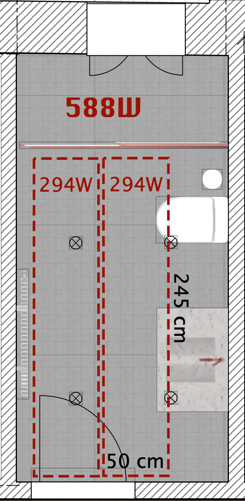

#### WC Grande

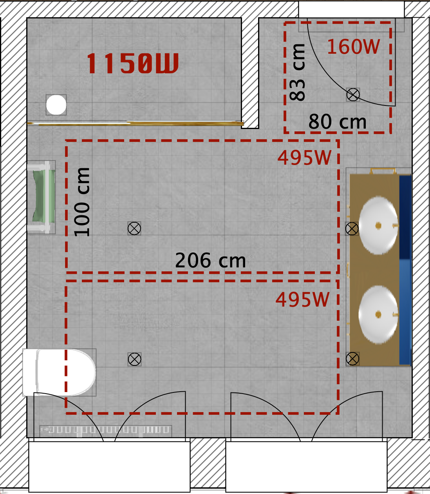

#### Hall

O radiante no hall não ficou ligado, portanto não funciona.

asd -adasdas

#### Lavandaria

#### Corredor

#### Quarto RT

#### Quarto Visitas

#### Quarto G

#### Quarto L

## Ar codicionado

O ar condicionado foi projectado para o 2º andar, visto ter necessidades não só de aquecimento mas também de arrefecimento mais complexo, devido à excessiva exposição solar e protecção térmica mais ténue.

# Electricidade

A casa tem uma rede combinada de electricidade, em conformidade com o plano de especialidades.

Todos os circuitos da casa são monitorizados por componentes Shelly Pro 4PM, que permitem fazer medições individualizadas de cada um.

A cablagem electrica em uso consite em cabos de 1,5 para iluminação, e 2,5 para tomadas.

## Interruptores de luz

Todos os interruptores de luz são da marca Currysmarter [link](https://currysmarter.com/), com LED, aplicação smart-home e interligação com Alexa / Google Home.

## Interruptores de persianas

Todos os interruptores de persianas são da marca Currysmarter [link](https://currysmarter.com/), com LED, aplicação smart-home e interligação com Alexa / Google Home.

## Iluminação

A iluminação é feita com focus GU10 da Philips Hue, fitas LED também da Philips Hue e candeeiros suspensos.

O resumo da iluminação nas diversas áreas da casa é resumido abaixo.

| Divisão            | Focus  | Candeeiros | Fitas de LED (ML) |
| ------------------ | ------ | ---------- | ----------------- |
| **Rés de Chão**    |        |            |                   |
| WC                 | 3      |            | 2                 |
| Hall               | 3      |            |                   |
| Cozinha            | 7      | 1          | 11,66             |
| Sala               | 20     | 2          | 21,58 + 24,62     |
| **Hall / Escadas** | 5      | 1          |                   |
| **1º Andar**       |        |            |                   |
| Quarto RT          | 8      |            |                   |
| Quarto Visitas     | 6      |            |                   |
| WC Pequeno         | 4      |            |                   |
| Lavandaria         | 7      |            |                   |
| Quarto L           | 6      |            |                   |
| WC Grande          | 4      |            |                   |
| Quarto G           | 6      |            |                   |
| Corredor           | 4      |            |                   |
| **Sotão**          | 10     | 2          |                   |
| **TOTAL**          | **93** | **6**      | **58**            |

De momento tenho os seguinte productos comprados:

Hue **46 Gu10 Brancas**

Goovee **20 Gu10 coloridas**

Já estão **15 Gu10 brancas** instaladas

Total: **81 luzes**

Faltam: **12 luzes**

As Goovee ficavam bem na sala e sala de jantar.

No quarto RT, deveriam ficar 8 Hue coloridas.

Dai o que é recomendável comprar é: 

8 Gu10 Hue Color - €85,12 (net) cada 3 - **€255**

Total: **255 euros** (net)

### Iluminação do sotão

A iluminação do sotão é composta por 3 grupos (G) de luzes e 2 candeeiros (C).

A fileira de interruptores no cimo da escada está configurada da seguinte forma:

- o primeiro interruptor controla o C1 e o G1;
- o segundo interruptor controla o G2 e o G3;
- o terceiro interruptor controla o C2.

As lâmpadas Gu10 nesta divisão são de várias marcas, conforme indicado abaixo:

- As 2 lâmpadas do **Grupo 1** são lâmpadas genéricas (**Smart GU10**), coloridas com controlo Wi-fi;
- As 6 lâmpadas do **Grupo 2** são lâmpadas **Govee** GU10 Coloridas, com controlo wi-fi;
- As 4 lâmpadas do **Grupo 3** são lâmpadas **OSRAM Smart+** Spot Gu10 Tunable White, controlo ZigBee.

## Tomadas electricas

As tomadas eléctricas são na sua grande maioria convencionais, no entanto nos WCs tem protecção anti-humidade e em muitos dos pontos têm ligação directa USB e USB-C.

| Divisão         | Individuais | Duplas | Triplas | Quadruplas | USB / USB-C | ITED               | Notas                                 |
| --------------- | ----------- | ------ | ------- | ---------- | ----------- | ------------------ | ------------------------------------- |
| **Rés de Chão** |             |        |         |            |             |                    |                                       |
| WC              | 3           | 1      |         |            | 1           |                    | a dupla é superior                    |
| Hall            | 5           |        |         |            |             |                    |                                       |
| Cozinha         | 11          | 1      | 1       |            | 1           | 1 numa tripla      | 8 das 11 individuais estão escondidas |
| Sala            | 7           | 2      | 2       | 1          | 1           | 3 ited numa tripla |                                       |
| **Escadas**     | 5           |        |         |            |             |                    |                                       |
| **1º Andar**    |             |        |         |            |             |                    |                                       |
| Quarto RT       | 8           | 1      |         |            | 2           | 1 em dupla         |                                       |
| Quarto Visitas  | 4           | 1      |         |            | 2           | 1 em dupla         |                                       |
| WC Pequeno      | 1           |        |         |            |             |                    |                                       |
| Lavandaria      | 6           | 2      |         |            |             |                    |                                       |
| Quarto L        | 6           |        | 1       |            | 2           | 1 em tripla        |                                       |
| WC Grande       | 2           |        |         |            |             |                    |                                       |
| Quarto G        | 6           | 1      |         |            | 2           | 1 em dupla         |                                       |
| Corredor        |             |        |         |            |             |                    |                                       |
| **Sotão**       | 8           | 1      | 2       |            | 2           | 1 em individual    |                                       |
| **TOTAL**       | **72**      | **10** | **6**   | **1**      | **15**      | **9**              |                                       |
|                 | 54          | 10     | 6       | 1          | 13          |                    |                                       |

As tomadas electricas a serem instaladas são da **BSEED E-Series**. Inicialmente foram instaladas algumas de outras marcas, mas a ideia é transferir tudo para a BSEED para ficar tudo consistente.

Faltam 18 tomadas

[Em packs de 4](https://www.amazon.es/-/pt/dp/B0CCVJM7XB/ref=sr_1_95?crid=ZR883GDHJKML&dib=eyJ2IjoiMSJ9.NHfIOeX_I5bS-4jgUaiEjAHTxNtqYKAk0M22hsTZ0yMbrixNEwVH8NpWZ33UyloJNDgddKEhfVv1Zj_nkBi8ZOQ_N3IlIWtBL4VjK3S_1uHApQu7H4LZPAe_SfTWBXlopNOHhgDZJyfbfHs-SN8MUzU1H6GeoYu6cCr2ubSnoE-yfmkmxg1fMCDVvgga6GMQsZ0YFFI3WGzFey1dZPxYyToEWX5NJQRcInaVkQrhVJFeS1p84nwkHKLWoJp8Pd3tBrPwTUuxXA4fNNbGMmTvPZIPyM9hYvx4AH0kb1HWlXI.ZssFpVib5HNICYJQ4nMCvfmasg7K-IrrlKGmPJy4CK0&dib_tag=se&keywords=bseed%2Be%2Bseries&qid=1748877927&sprefix=bseed%2Be%2Bseries%2Caps%2C108&sr=8-95&xpid=dZANnBJ9v7v1d&th=1) - €23,59 (faltam 4 packs e as outras 2 podem ser das que já tenho)

Total: €94,36 (net)

# Águas e Canalização

À excepção dos tubos que passam por baixo do chão no rés-de-chão, que são PEX, todos os tubos de canalização da casa são multicamada.

A entreda de águas na casa, conta com um filtro de osmose inversa, assim como um filtro descalcificador. O filtro de **osmose inversa** requer uma manutenção de periocidade **anual**, enquanto o **filtro descalcificador** tem um tempo de vida de **7 a 8 anos**.

Em conformidade com as especialidades, a casa tem um **circuito de re-circulação** da água, que permite em meros segundos ter água quente em qualquer ponto da casa.

## Geral

O projecto de abastecimento geral é demonstrado abaixo.

## Abastecimento Rés-de-chão

A planta de abastecimento do Rés-de-chão é demonstrada de seguida.

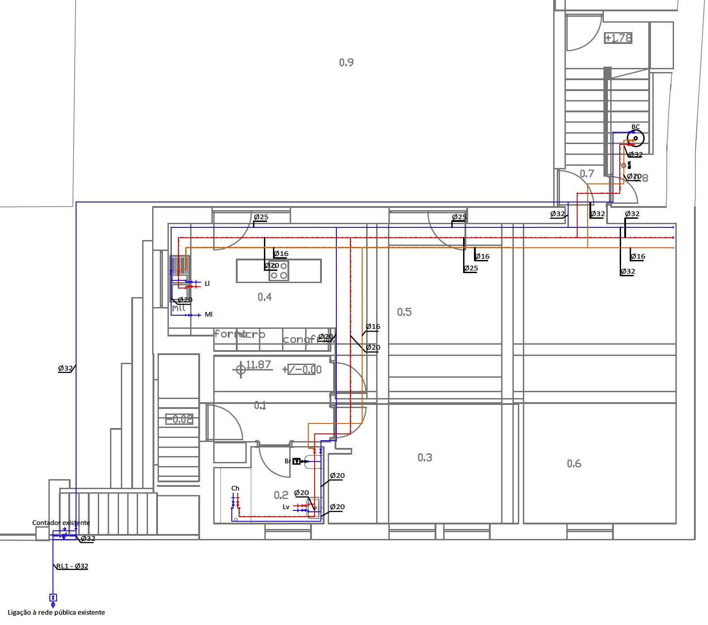

## Abastecimento do 1º andar

A planta de abastecimento do 1º andar é demonstrada de seguida.

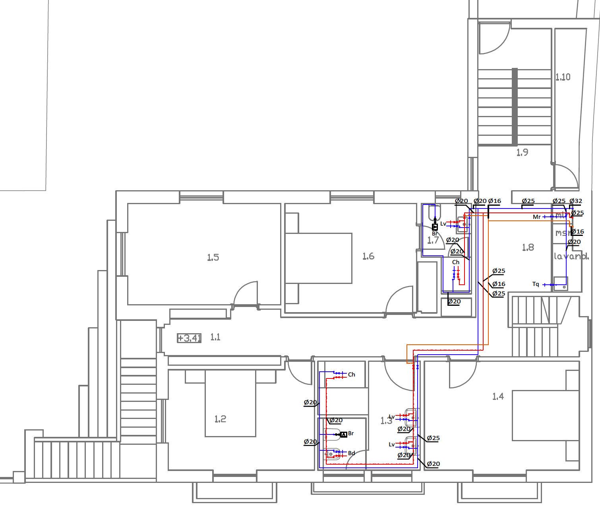

## Abastecimento do 2º andar

A planta de abastecimento do 2º andar é demonstrada de seguida.

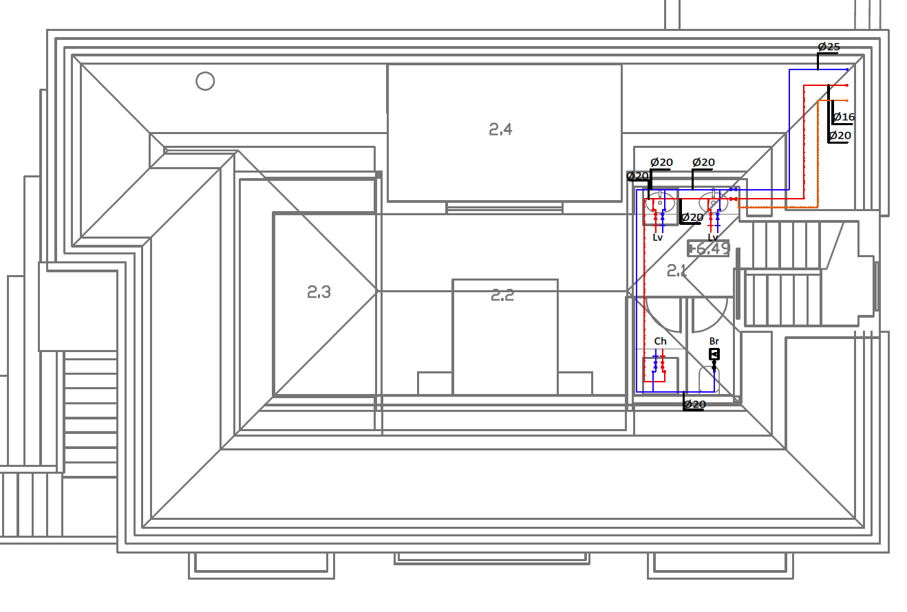

O abastecimento do 2º andar, ao invés da planta, faz-se a partir do centro da parede nascente, por cima do quarto nascente/sul do 1º andar. Esta foi uma alteração ao projecto por uma questão de facilitar a instalação.

# Águas Residuais

A rede de esgotos foi feita com tubos acústicos de saneamento, para garantir a insonorização da passagem de detritos e águas.

Existem 2 saídas de esgotos da casa, que convergem antes do ramal. Uma das saídas passa junto à frente da casa, pela zona do WC do rés-de-chão, enquanto a outra sai pela zona poente, junto aos interruptores da sala.

## Planta Vertical

A rede de esgotos tem um ramal exclusivo de saída para a rede pública.

## Planta de Rés-de-chão

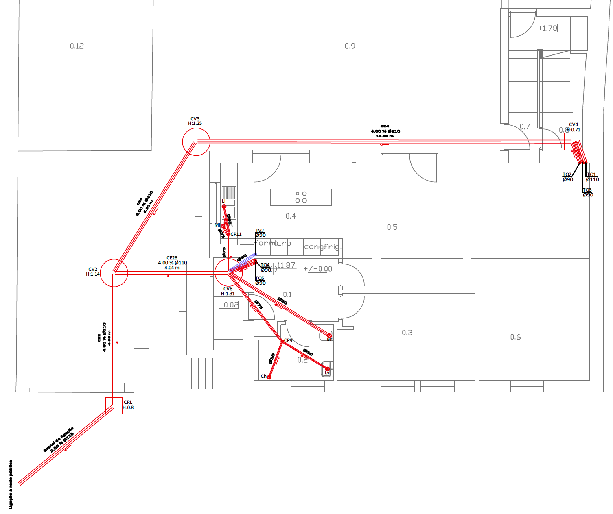

## Planta do 1º andar

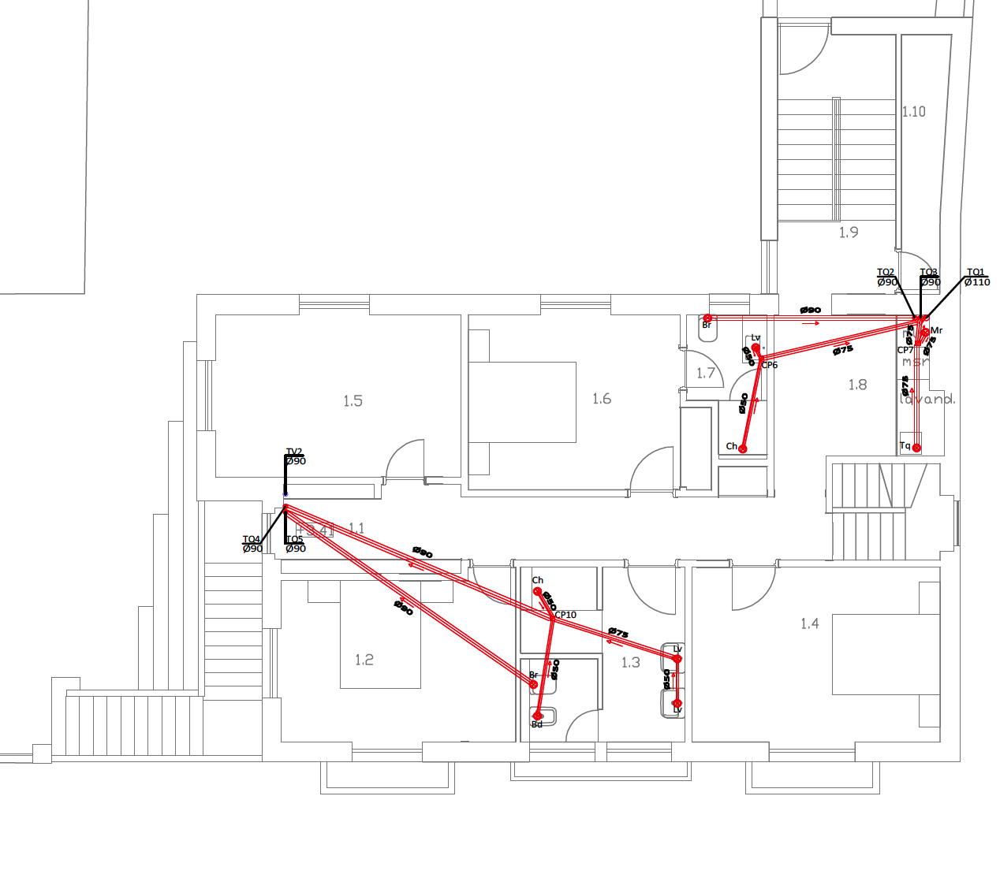

## Planta do 2º andar

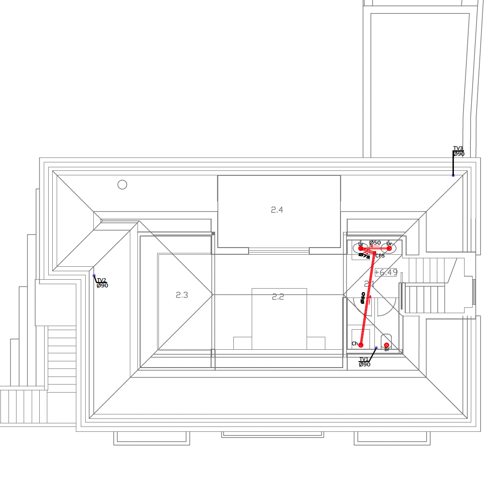

# Águas pluviais

Existe uma rede de drenos de águas pluviais por baixo da placa do rés-de-chão, assim como em volta do terraço da casa. A sala das máquinas descarrega algumas águas para a rede drenos do terraço.

A rede de águas pluviais tem um ramal exclusivo de saída para a rede pública.

## Planta Geral

## Planta Vertical

## Planta do Rés-de-chão

## Planta do 1º andar

## Planta do 2º andar

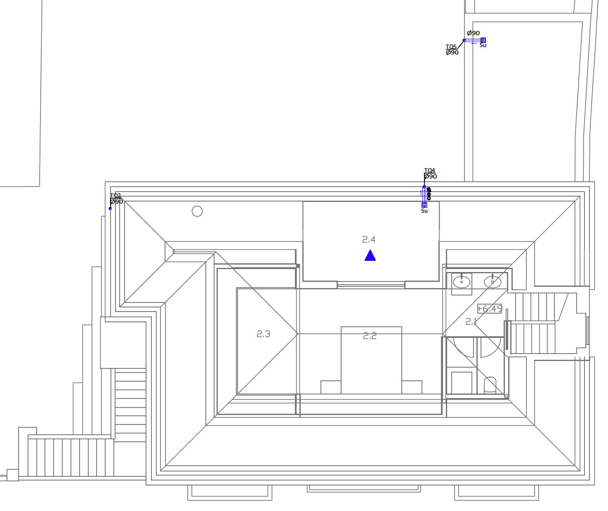

# Persianas / Estores

| Zona | Descrição         | Quantidade |
| ---- | ----------------- | ---------- |
| R/C  | Cozinha           | 1          |
| R/C  | Sala              | 3          |
| R/C  | WC                | 1          |
| 1º   | WC Pequeno        | 1          |
| 1º   | Quarto convidados | 1          |
| 1º   | Quarto RT         | 2          |
| 1º   | Quarto G          | 2          |
| 1º   | WC Grande         | 2          |
| 1º   | Quarto L          | 1          |
| 2º   | Varanda           | 1          |

# ITED

A rede ITED da casa é composta por elementos de telecomunicações que vão desde o vídeo-porteiro até à rede de comunicações por rede e sinal de televisão.

## Vídeo-porteiro

O vídeo-porteiro tem um elemento de comuniação no exterior da casa, que permite ver e comunicar com quem o acciona. A comunicação é estabelecida com os elemento intermos da casa que estão dispostos nos 3 pisos. Existe um intercomunicador no rés-de-chão, na sala perto do hall de entrada, outro no 1º andar na lavandaria e outro no 3º andar junto às escadas.

## Rede de comunicações RJ45

Existem ligações de rede RJ45 em todos os quartos assim como no rés-de-chão e 2º andar. Além das mesmas, existe ainda router-switches que fazem a distribuição da rede nos 3 pisos. As mesmas são capacitadas de tecnologia PoE (Power over Ethernet) que permite não só comunicar com os dispositivos, assim como os permite carregar em baixa potência.

## Sinal de televisão

A casa está equipada com distribuidore de sinal de TV nos 3 pisos. O sinal é adquirido a partir do router central de comunicações e ainda através de antena parabólica instalada no telhado.

## Plantas de telecomunicações

### Esquema de ligações ATI

### ITED Rés-de-chão

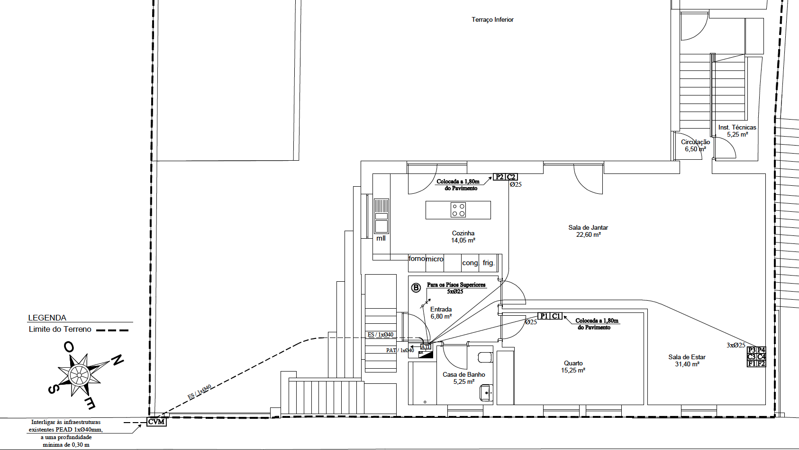

### ITED 1º andar

### ITED 2º andar

# Multimédia

## Som

### Regras

| Room Size | Speaker Quantity |
| --------- | ---------------- |
| 1-10m²    | 1 speaker        |
| 11-30m²   | 2 speakers       |
| 31-60m²   | 4 speakers       |
| 61-80m²   | 6 speakers       |

### Colunas

* [Arylic WBC65 6.5" Wireless Multiroom Ceiling Speaker](https://www.arylic.com/products/wbc65-wireless-multiroom-ceiling-speaker?srsltid=AfmBOopcj0rjAXRYJQ394_a2A20IxdsHC0oVoDj_Q17Komyj0TB1I0kT) × **8** (Master + Slave)
* [Arylic WBC65 6.5" Wireless Multiroom Ceiling Speaker](https://www.arylic.com/products/wbc65-wireless-multiroom-ceiling-speaker?srsltid=AfmBOopcj0rjAXRYJQ394_a2A20IxdsHC0oVoDj_Q17Komyj0TB1I0kT) × **4** (mono)
* [Arylic RK30 Wall Mount Cube Speaker](https://www.arylic.com/products/wall-mount-speaker-rk30?srsltid=AfmBOoodY9McK-6ItLS3NItCWxfwFgm1-vUEHkhBiKlJfZ44wsccyRyU) (pair) × **3**
* [Polk Audio RC60i ](https://www.polkaudio.com/product/built-in-speakers/in-ceiling/rc60i/112720.html) (pair) x **2**
* [Arylic Up2Stream Mini](https://www.arylic.com/products/up2stream-mini-receiver-board?srsltid=AfmBOorydGVmRCdsU5sjFc7m5MKgzuKYR7OrSXC_Ry9KvWl1pAiWD6fr) - Multiroom Wi-Fi Streamer Board (No Amp) × **5**
* [Arylic Up2Stream Amp](https://www.arylic.com/products/up2stream-amp-2-1-amp-board?srsltid=AfmBOoqahP8uDdpB2PI2MOlTRf3R713Ya90pfDc3ugkPranYpeO8uJiK) - Multiroom Wireless Streaming Stereo Amplifier Board × **7**
* [Arylic A50+ 50W x 2 Streaming Amplifier](https://www.arylic.com/products/arylic-a50-wifi-bluetooth-multiroom-full-digital-hifi-amplifier-with-airplay-dlna-multiroom-control?srsltid=AfmBOopGjMy7WEGoaNOjEWfPF0P6irflQqP_3_EEECzyXCtTHkDkNSLk) × **1**

Nota: As colunas Arylic RK30 precisam de um amplificador. O aconselhado para cada par de colunas é [A30+ 30W x 2 WiFi Mini Stereo Amplifier](https://www.arylic.com/products/a30-wireless-amplifier?srsltid=AfmBOop9eoESdIk50I_N6rZxGnuv54OL7SghNEA_Bnm5ShlCa1kOaz7Z).

Ainda pretendemos comprar um subwoofer embutido para tecto https://www.thomann.pt/bose_designmax_dm8c_sub_white.htm

### Mapa de Colunas

#### Rés-de-chão

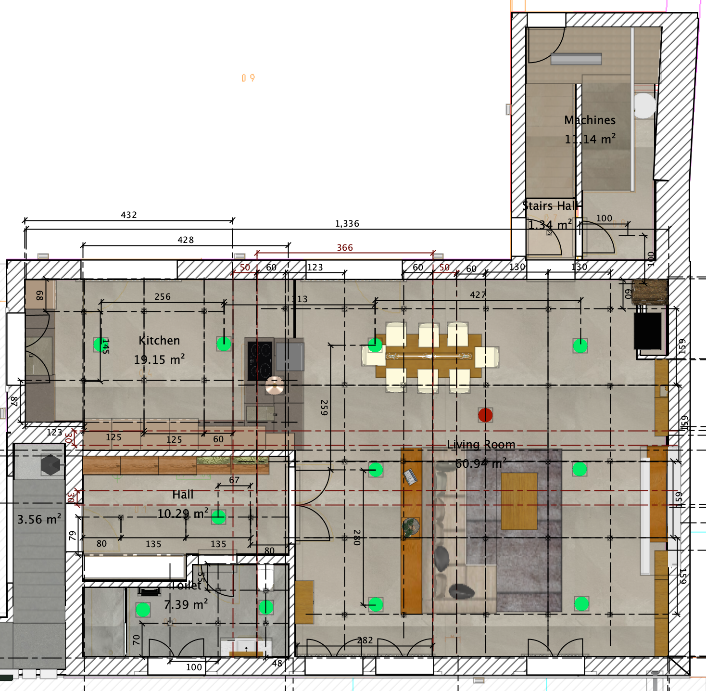

#### 1º andar

#### 2º andar

## Projector

A passagem para o projector tem 2 cabos a passar:

- 1 cabo HDMI (input)
- 1 cabo de currente 220V

O elevador do projector tanto pode ser controlado com o controlo remoto, como pode ser controlado com o controlo central que fica por baixo da TV.

Tenho que procurar o melhor projector com as seguintes características:

- 4K native
- ceiling mount
- android system
- under $1000

# Cozinha

## Modelo 3D

## Electrodomésticos

Na cozinha temos uma panóplia de electrodomésticos, cujas as dimensão são especificadas abaixo.

| Item                         | Marca        | Modelo              | Dimensões de instalação (AxLxP) |
| ---------------------------- | ------------ | ------------------- | ------------------------------- |
| Frigorífico                  | Bosch        | KIR81AFE0 Series 6  | 1775.0 x 560 x 550              |
| Placa de indução             | Bosch        | PXX875D67E Series 8 | 223 x 750-750 x 490-490         |
| Microondas                   | Bosch        | BFR634GS1           | 220 x 350 x 270                 |
| Gaveta de Aquecimento        | Bosch        | BIC630NS1           | 140 x 560 x 550                 |
| Forno                        | Bosch        | HBG675B.1           | 585-595 x 560-568 x 550         |
| Máquina de Lavar Louça       | AEG          | FSE76727P           | 818 x 596 x 560                 |
| Frigorifico de vinhos        | GGM Gastro   | WKM100S-2N          | 840 x 495 x 580                 |
| Aspirador debaixo da bancada | Ritter       | 940610              | 105 x 450 x 365                 |
| Triturador de resíduos       | InSinkerator | Evolution 100-3B    | ver manual                      |

## Lava-loiças

Na cozinha existem 2 lava-loiças, um principal e um auxiliar perto da zona da placa de indução.

Ambos são da Blanco Subline, um do modelo 700U e outro do modelo 160U.

As especificações de ambos seguem abaixo.

## Buracos na bancada

Temos ainda 7 buracos na bancada, com as seguintes especificações.

| Item                             | Diametro (mm) |
| -------------------------------- | ------------- |
| **Pia Principal**                |               |
| Torneira                         | 35            |
| Dispensadores de detergente (2x) | 27            |
| Botão do triturador              | 33            |
| **Pia Secundária**               |               |
| Torneira                         | 35            |
| Dispensador de detergente        | 27            |
| **Tomada elétrica extraível**    | 125           |

# Exteriores

## Pavimentos

O pavimento da entrada da casa é da Macel com referência 204/5.

O pavimento do terraço traseiro é da AMOP.

# Manuais de instruções

O objectivo deste capítulo é ter acesso facilitado e rápido aos manuais de instruções dos diversos dispositivos e elementos da casa. Abaixo segue uma lista com os diversos documentos.

| ID   | Descrição                                              | Link                                                         |
| ---- | ------------------------------------------------------ | ------------------------------------------------------------ |
| 01   | Frigorífico                                            | [Bosch KIR81AFE0 Series 6](./User_Manuals/Frigorifico_Bosch_KIR81AFE0_Series_6/9001595475_A.pdf) |
| 02   | Motor de Projector                                     | [TLMPL-1M](./User_Manuals/Motorized_Projector_Lift_User_Manual_Model_TLMPL-1M_TLMPL_1.5M.pdf) |
| 03   | Forno                                                  | [Bosch_HBG675B.1](./User_Manuals/Forno_HBG675B.1/9001650191_C.pdf) |
| 04   | Aspirador de Cozinha                                   | [Ritter_940610](./User_Manuals/Aspirador_Cozinha_940610_BedAnl_XX_Einbau-Sockelsauger-SES10-BVC10-0721-Internet.pdf) |
| 05   | Gaveta de Aquecimento                                  | [Bosch_BIC630NS1](./User_Manuals/Gaveta_de_Aquecimento/9001280520_C.pdf) |
| 06   | Microondas                                             | [Bosch BFR634GS1](./User_Manuals/Microondas/9001654577_G.pdf) |
| 07   | Secadora de roupa                                      | [Bosch WTW87541 Series 8](./User_Manuals/Secadora/9001276303_A.pdf) |
| 08   | TV Philips                                             | [TV Philips 50´´](./User_Manuals/TV_Philips/975e08d5d49d45e7a2d2afbf0079659c.pdf) |
| 09   | TV Samsung                                             | [TV Philips 85´´](./User_Manuals/TV_Samsung/BN68-16813B-01_UM_Y23 QLED UHD QD_XC_L09_240605.0.pdf) |
| 10   | Frigorífico para vinhos                                | [Wine Cooler WKM100S-2N](./User_Manuals/WKM Manual EN DE.pdf) |
| 11   | Máquina Loiça                                          | [AEG FSE76727P](./User_Manuals/Máquina_Lavar_Loiça/117832391_UserManual_241123NRVM.pdf) |
| 12   | Placa de Indução                                       | [Bosch PXX875D67E Series 8](./User_Manuals/Placa_Indução/9001685210_D.pdf) |
| 13   | Máquina de gelo                                        | [Ice Maker EWBH356W-N](./User_Manuals/Ice_Maker/EN-OPERATION MANUAL-GGM.pdf) |
| 14   | Máquina lavar roupa ((falta fazer download do manual)) | [Bosch Series 6](./User_Manuals/.pdf)                        |
| 15   | Sirene de Alarme exterior                              | [Bosch Outdoor Siren](./User_Manuals/Bosch_Outdoor_Siren.pdf) |
| 16   | Curtinas Motorizadas - Rails                           | [Abalon_Tracks](./User_Manuals/Abalon-User-Manual_24_baja.pdf) |
| 17   | Aspirador de Casa e Jardim                             | [Bosch Advanced Vac 20](./User_Manuals/Aspirador_Garden_Bosch.pdf) |
| 18   | Colunas Polk rc60i                                     | [Polk rc60i](./User_Manuals/Sound/rc60i-rc80i-rc85i-owners-manual-en.pdf) |
| 19   | Arylic WBC65 6.5" Wireless Multiroom Ceiling Speaker   | [Arylic WBC65](./User_Manuals/Sound/WBC65_User_Manual_En_2021.pdf) |
| 20   | Arylic RK30 Wall Mount Cube Speaker                    | [Arylic RK30](./User_Manuals/Sound/RK30_User_Manual_EN_ba0ac6e6-1dfb-402e-b83e-75f61161039b.pdf) |
| 21   | Arylic Up2Stream Mini                                  | [Arylic Up2Stream Mini](./User_Manuals/Sound/Up2Stream_Mini_V3.0_Manual-en.pdf) |
| 22   | Arylic Up2Stream Amp                                   | [Arylic Up2Stream Amp](./User_Manuals/Sound/Up2Stream_AMP_Mono_Manual-EN.pdf) |
| 23   | Arylic A50+                                            | [Arylic A50+](./User_Manuals/Sound/A50_Manual_EN_20210821.pdf) |
| 24   | Bomba circuladora                                      | [Alpha2 25-60 180](./User_Manuals/Grundfosliterature-5564472_17061462.pdf) |
| 25   | Triturador de comida                                   | [InSinkErator Evolution 100 Waste Disposal Unit](./User_Manuals/ISE_FWD_InstallGuide_Sept20_1_Web.pdf) |
| 26   | Armário Servidor                                       | [Digitus Branco](./User_Manuals/ArmarioServidor.pdf)         |
| 27   | Currysmarter Smart Light Switch                        | [Currysmarter Light](./User_Manuals/Currysmarter Smart Light Switch.pdf) |
| 28   | Currysmarter Smart Shutter Switch                      | [Currysmarter Curtain](./User_Manuals/Currysmarter Shutter Switch.pdf) |
| 29   | Concealed_ceiling_curtain_user_manual                  | [Ceiling curtain projector](./User_Manuals/Concealed_ceiling_curtain_user_manual.pdf) |
| 30   | BSeed Smart Socket & Switch                            | [BSeed Switch](./User_Manuals/BSeed_Smart_Socket&Switch.pdf) |
|      |                                                        |                                                              |

# Propostas de orçamentos

Neste capítulo declaram-se os diversos orçamentos que tivemos para os diferentes serviços prestados. De notar que a obra foi realizada com o empreiteiro Manuel Rodrigues, que ao invés de se cobrar via orçamento apresentado, fazia trabalho cobrado à hora, com uma média de €15/hora.

| ID   | Descrição                                  | Link                                                         |
| ---- | ------------------------------------------ | ------------------------------------------------------------ |
| 01   | Orçamento para o banco                     | [Noxyster Group](./Orçamentos/22-029 ORÇ RITA PERALTA.pdf)   |
| 02   | Janelas Caixiterm [**escolhido**]          | [Caixiterm](./Orçamentos/Caixiterm_v3_€15380,60.pdf)         |
| 03   | Janelas RCL                                | [RCL](./Orçamentos/RCL.pdf)                                  |
| 04   | Cozinha JPMarques [**escolhido**]          | [JPMarques](./Orçamentos/JPMarques_Cozinhas_€11152,26.pdf)   |
| 05   | Cozinha Leroy Merlin                       | [Leroy Merlin Cozinha](./Orçamentos/Cozinha_Leroy_Merlin.pdf) |
| 06   | Cozinha Pedrosas                           | [Pedrosa e Filhos](./Orçamentos/PedrosaeFilhos_Raw_D_€9795,00.pdf) |
| 07   | Guarda-corpos Artimira [**escolhido**]     | [Artimira](./Orçamentos/Orcamento ORC_25_91.pdf)             |
| 08   | Guarda-corpos Vidraria Central do Porto    | [Vidraria Central do Porto](./Orçamentos/Vidraria_Central_do_Porto_2025_165.pdf) |
| 09   | Portas e Chão Beira Portal [**escolhido**] | [Beira Portal](./Orçamentos/BeiraPortal_€8678,02.pdf)        |
| 10   | Portas Covema                              | [Covema](./Orçamentos/Orçamento Portas Covema.pdf)           |
| 11   | Portas Bruno Miguel Pedrosa                | [Bruno Miguel Pedrosa](./Orçamentos/Bruno Miguel Pedrosa.pdf) |
| 12   | Portas Pedrosa e Filhos                    | [Pedrosa e Filhos](./Orçamentos/PedrosaeFilhos.pdf)          |
| 13   | Climatização Electroclima                  | [Electroclima](./Orçamentos/Electroclima.pdf)                |
| 14   | Caleiras                                   | [MetalCaleira](./Orçamentos/Caleiras_€750+IVA.pdf)           |
| 15   | Portas Beira Portal                        | [BeiraPortal](./Orçamentos/BeiraPortal_Portas.pdf)           |
| 16   | Chão Beira Portal                          | [BeiraPortal](./Orçamentos/BeiraPortal_Chão.pdf)             |
|      |                                            |                                                              |

# Certidão ARU

Todas as obras de benfeitoria que possam vir a ser executadas na casa, tem um beneficio fiscal, taxadas a 6% de IVA. Para tal, é necessário entregar o certificado ARU, que se encontra no seguinte [link](./Certificados/Certidao_ARU.pdf).

O prestador de serviços poderá/deverá introduzir o seguinte paragrafo na(s) factura(s):

Empreitada com Taxa de IVA reduzida para obras em edifícios situados da Área de Reabilitação Urbana (ARU) do Centro Urbano da Figueira da Foz conforme certidão no 226/2023 do Município de Figueira da Foz datado de 16/05/2023, referente ao prédio urbano sito Rua Dez de Agosto, no113 - Freguesia de Buarcos e São Julião, Artigo Matricial Urbano no 1282.